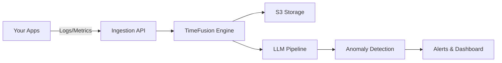

<div align="right">

[Website](https://apitoolkit.io) • [Discord](https://discord.gg/monoscope) • [Twitter](https://twitter.com/apitoolkit) • [Changelog](CHANGELOG.md) • [Documentation](https://docs.apitoolkit.io)

</div>

<div align="center">


# Monoscope

### Open-source observability platform that understands your systems

[](https://github.com/apitoolkit/apitoolkit-server/releases)
[](LICENSE)
[](https://www.haskell.org/)
[](https://discord.gg/monoscope)
[](https://github.com/apitoolkit/apitoolkit-server/actions)

</div>

<div align="center">
  <strong>
    <a href="#-quick-start">Quick Start</a> • 
    <a href="#-key-features">Features</a> • 
    <a href="#-demo">Demo</a> • 
    <a href="#-documentation">Docs</a> • 
    <a href="#-community">Community</a>
  </strong>
</div>

<br />

<div align="center">
  
  <p><i>Monoscope automatically detects anomalies in your logs, metrics, and traces using AI — no configuration required.</i></p>
</div>

## 🚀 Quick Start

```bash
# Run with Docker (recommended)
docker run -p 8080:8080 apitoolkit/monoscope:latest

# Or clone and run locally
git clone https://github.com/apitoolkit/apitoolkit-server.git
cd apitoolkit-server
docker-compose up
```

Visit `http://localhost:8080` to access Monoscope. [Full installation guide →](docs/installation.md)

## 🎯 Key Features

<table>
  <tr>
    <td width="50%">
      <h4>🤖 AI-Powered Anomaly Detection</h4>
      <p>LLM-based engine that understands context and identifies real issues, not just threshold violations</p>
    </td>
    <td width="50%">
      <h4>💬 Natural Language Queries</h4>
      <p>Search logs and metrics using plain English - no complex query languages required</p>
    </td>
  </tr>
  <tr>
    <td width="50%">
      <h4>⚡ Built for Scale</h4>
      <p>Handle millions of events/sec with our custom TimeFusion storage engine</p>
    </td>
    <td width="50%">
      <h4>💰 Cost-Effective Storage</h4>
      <p>Store years of data affordably with S3-compatible object storage</p>
    </td>
  </tr>
</table>

## 📸 Screenshots

<div align="center">
<table>
  <tr>
    <td width="50%">
      
      <p align="center"><i>Log Explorer - Main View</i></p>
    </td>
    <td width="50%">
      
      <p align="center"><i>Log Explorer - Detailed View</i></p>
    </td>
  </tr>
  <tr>
    <td width="50%">
      
      <p align="center"><i>Dashboard Analytics</i></p>
    </td>
    <td width="50%">
      
      <p align="center"><i>Monoscope - Powered by APIToolkit</i></p>
    </td>
  </tr>
</table>
</div>

## 🏗️ Architecture Overview

Monoscope combines high-performance data ingestion with intelligent AI analysis:



- **Language**: Built in Haskell for reliability and performance
- **Storage**: S3-compatible object storage for cost-effective retention
- **AI Engine**: State-of-the-art LLMs for intelligent analysis
- **Scale**: Horizontally scalable architecture

## 🌟 Why Monoscope?

### The Problem
Traditional monitoring tools require extensive configuration, generate overwhelming alerts, and still miss critical issues. You spend more time managing your monitoring than actually using it.

### Our Solution
Monoscope uses AI to understand your system's behavior, automatically detect anomalies, and provide actionable insights - all without complex configuration.

### Who Uses Monoscope?

- **DevOps Teams** reducing alert fatigue by 90%
- **SREs** catching issues before they impact users
- **Engineering Leaders** getting visibility across complex systems
- **Startups** implementing enterprise-grade observability on a budget

## 📚 Documentation

- [Features](#features)
- [Getting Started](#getting-started)
- [Prerequisites](#prerequisites)
- [Installation](#installation)
- [Development Setup](#development-setup)
- [Testing](#testing)
- [Useful Links](#useful-links)
- [Contributing](#contributing)
- [License](#license)

---

## Features

- 🤖 **AI-Powered Anomaly Detection**: Leverages LLMs to automatically identify and alert on unusual patterns
- ☁️ **S3-Compatible Storage**: Store logs, metrics and traces in any S3-compatible object storage
- 🚀 **High Performance**: Written in Haskell and rust for reliability and performance
- 📈 **Real-Time Analytics**: Monitor your systems with minimal latency
- 🔌 **Extensible**: Easy to integrate with existing monitoring infrastructure

### Getting Started
- [Installation Guide](docs/installation.md)
- [Configuration](docs/configuration.md)
- [API Reference](docs/api.md)
- [Architecture Deep Dive](docs/architecture.md)

### Tutorials
- [5-Minute Quick Start](docs/quickstart.md)
- [Monitoring Kubernetes](docs/kubernetes.md)
- [Custom Dashboards](docs/dashboards.md)
- [Alert Configuration](docs/alerts.md)

## 🛠️ Installation

<details>
<summary><strong>Prerequisites</strong></summary>

### Prerequisites

Before installing Monoscope, ensure you have the following dependencies:

- **Haskell**: Install via GHCup
- **PostgreSQL with TimescaleDB**: For time-series data storage
- **LLVM**: Required for compilation
- **Google Cloud SDK**: For GCP integration (if using GCP)

### Installation

1. **Install Haskell via GHCup**

```bash
curl --proto '=https' --tlsv1.2 -sSf https://get-ghcup.haskell.org | sh
```

2. **Clone the Repository**

```bash
git clone https://github.com/apitoolkit/apitoolkit-server.git monoscope
cd monoscope
```

3. **Install System Dependencies**

**For macOS:**

```bash
# Install LLVM
brew install llvm

# Install PostgreSQL with TimescaleDB
brew install postgresql
brew install timescaledb

# Install libpq
brew install libpq
```

**For Linux (Ubuntu/Debian):**

```bash
# Install LLVM
sudo apt-get install llvm

# Install PostgreSQL and TimescaleDB
# Follow instructions at: https://docs.timescale.com/install/latest/

# Install libpq
sudo apt-get install libpq-dev
```

4. **Configure Google Cloud (Optional)**

If using Google Cloud integration:

```bash
gcloud auth application-default login
```

5. **Run Monoscope**

```bash
stack run
```

</details>

<details>
<summary><strong>Development Setup</strong></summary>

## Development Setup

### Database Setup with Docker

1. **Create a Docker volume for PostgreSQL data:**

```bash
docker volume create pgdata
```

2. **Run TimescaleDB in Docker:**

```bash
make timescaledb-docker
```

3. **Configure pg_cron extension:**

Add the following to your PostgreSQL configuration:

```sql
ALTER system SET cron.database_name = 'apitoolkit';
ALTER system SET shared_preload_libraries = 'pg_cron';
```

Then restart the TimescaleDB Docker container.

### Development Tools

**Install code formatting and linting tools:**

```bash
# Code formatter
brew install ormolu

# Linter
brew install hlint
```

**Useful commands:**

```bash
# Format code
make fmt

# Run linter
make lint
```

💡 **Tip**: For better IDE support, compile Haskell Language Server locally to avoid crashes, especially on macOS. See [issue #2391](https://github.com/haskell/haskell-language-server/issues/2391).

### Service Worker

To build the service worker:

```bash
workbox generateSW workbox-config.js
```

</details>

## 🧪 Testing

<details>
<summary><strong>Running Tests</strong></summary>

### Run all tests

```haskell
make test
# OR
stack test --ghc-options=-w
```

### Run only unit tests

Unit tests don't require a database connection and run much faster. They include doctests and pure function tests.

```haskell
make test-unit
# OR
stack test apitoolkit-server:unit-tests --ghc-options=-w
```

### Run unit tests with file watching for development

```haskell
make live-test-unit
# OR
stack test apitoolkit-server:unit-tests --ghc-options=-w --file-watch
```

### Run a specific individual test

```haskell
stack test --test-arguments "--match=SeedingConfig" apitoolkit-server:tests
# OR
stack test --ta "--match=SeedingConfig" apitoolkit-server:tests
```

</details>

## 🤝 Community

- 💬 [Discord](https://discord.gg/monoscope) - Chat with users and contributors
- 🐛 [Issues](https://github.com/apitoolkit/apitoolkit-server/issues) - Report bugs or request features
- 🐦 [Twitter](https://twitter.com/apitoolkit) - Follow for updates
- 📝 [Blog](https://blog.apitoolkit.io) - Tutorials and case studies

## 🌍 Contributing

We welcome contributions to Monoscope! Please feel free to:

- Report bugs and request features via [GitHub Issues](https://github.com/apitoolkit/apitoolkit-server/issues)
- Submit pull requests for bug fixes and new features
- Improve documentation and examples
- Share your use cases and feedback

Before contributing, please read our contributing guidelines and ensure your code passes all tests and linting checks.

## 📄 License

Monoscope is open source software. Please see the LICENSE file for details.

## 🚀 Roadmap

- [ ] Kubernetes Operator
- [ ] Terraform Provider
- [ ] Mobile App
- [ ] Distributed Tracing Support
- [ ] Custom ML Model Training

See our [public roadmap](https://github.com/apitoolkit/apitoolkit-server/projects) for more details.

## 🏆 Comparisons

| Feature | Monoscope | Datadog | Elastic | Prometheus |
|---------|-----------|---------|---------|-------------|
| AI Anomaly Detection | ✅ Built-in | ❌ Add-on | ❌ | ❌ |
| Natural Language Search | ✅ | ❌ | ❌ | ❌ |
| Cost-Effective Storage | ✅ S3 | ❌ Proprietary | ✅ | ✅ |
| No Configuration Alerts | ✅ | ❌ | ❌ | ❌ |
| Open Source | ✅ | ❌ | ✅ | ✅ |

---

<div align="center">
  <h3>Ready to transform your observability?</h3>
  <a href="https://github.com/apitoolkit/apitoolkit-server"></a>
  <br />
  <sub>Built with ❤️ by the <a href="https://apitoolkit.io">APIToolkit</a> team</sub>
</div>
