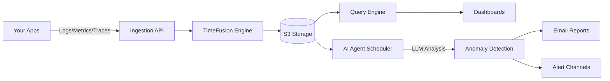

<div align="center">

<picture>
  <source media="(prefers-color-scheme: dark)" srcset="/static/public/assets/svgs/logo_white.svg">
  <source media="(prefers-color-scheme: light)" srcset="/static/public/assets/svgs/logo_black.svg">
  
</picture>

### Open-source observability platform with S3 storage

Ingest and explore logs, traces, and metrics stored in your S3 buckets. Query with natural language. Create AI agents that detect anomalies and send daily/weekly reports to your inbox.

[](https://github.com/monoscope-tech/monoscope/releases)
[](LICENSE)
[](https://www.haskell.org/)
[](https://discord.gg/BSFCaUHxt4)

[**Website**](https://monoscope.tech) • [**Discord**](https://discord.gg/BSFCaUHxt4) • [**Twitter**](https://x.com/monoscope-tech) • [**Documentation**](https://docs.monoscope.tech)

</div>

<div align="center" style="margin-top: 1em; margin-bottom: 1em;">
<a href="#what-is-monoscope">What is Monoscope?</a> • <a href="#cloud-vs-self-hosted">Cloud vs Self-hosted</a> • <a href="#quick-start">Quick Start</a> • <a href="#ai-agents--reports">AI Agents</a> • <a href="#roadmap">Roadmap</a>
</div>

<br />

<div align="center">
  
</div>

<br/>

## What is Monoscope?

Monoscope is an open-source observability platform that stores your telemetry data in S3-compatible storage. Self-host it or use our [cloud offering](https://monoscope.tech).

**Core capabilities:**

- 💰 **S3 storage** — Store years of logs, metrics, and traces affordably in your own S3 buckets
- 💬 **Natural language queries** — Search your data using plain English via LLMs
- 🤖 **AI agents** — Create agents that run on a schedule to detect anomalies and surface insights
- 📧 **Email reports** — Receive daily/weekly summaries of important events and anomalies
- 🔭 **OpenTelemetry native** — 750+ integrations out of the box
- ⚡ **Live tail** — Stream logs and traces in real-time
- 🕵️ **Unified view** — Correlate logs, metrics, traces, and session replays in one place

<br/>

## Cloud vs Self-hosted

In both options, you bring your own S3 buckets—your data stays yours.

| | Cloud | Self-hosted |
|---|---|---|
| **Storage** | Your S3 buckets | Your S3 buckets |
| **Compute** | Managed by us | You manage |
| **Auth & SSO** | Built-in | DIY |
| **Alert channels** | Slack, PagerDuty, etc. | Basic email |
| **Pricing** | [Usage-based](https://monoscope.tech/pricing) | Free (AGPL-3.0) |

→ [Start free on Cloud](https://monoscope.tech) or continue below to self-host.

<br/>

## Quick Start

```bash
git clone https://github.com/monoscope-tech/monoscope.git
cd monoscope
docker-compose up
```

Visit `http://localhost:8080` (default: admin/changeme)

### Send Test Data

Populate your dashboard with test telemetry:

```bash
# Install telemetrygen
go install github.com/open-telemetry/opentelemetry-collector-contrib/cmd/telemetrygen@latest

# Send test traces (replace YOUR_API_KEY from the UI)
telemetrygen traces --otlp-endpoint localhost:4317 --otlp-insecure \
  --otlp-header 'Authorization="Bearer YOUR_API_KEY"' --traces 10
```

<br/>

## Integration

### Auto-instrument your apps

<details>
<summary><b>Python</b></summary>

```bash
pip install opentelemetry-distro opentelemetry-exporter-otlp
opentelemetry-bootstrap -a install
OTEL_SERVICE_NAME="my-app" \
OTEL_EXPORTER_OTLP_ENDPOINT="http://localhost:4317" \
opentelemetry-instrument python myapp.py
```

</details>

<details>
<summary><b>Node.js</b></summary>

```bash
npm install --save @opentelemetry/auto-instrumentations-node
OTEL_SERVICE_NAME="my-app" \
OTEL_EXPORTER_OTLP_ENDPOINT="http://localhost:4317" \
node --require @opentelemetry/auto-instrumentations-node/register app.js
```

</details>

<details>
<summary><b>Java</b></summary>

```bash
curl -L https://github.com/open-telemetry/opentelemetry-java-instrumentation/releases/latest/download/opentelemetry-javaagent.jar -o otel-agent.jar
OTEL_SERVICE_NAME="my-app" \
OTEL_EXPORTER_OTLP_ENDPOINT="http://localhost:4317" \
java -javaagent:otel-agent.jar -jar myapp.jar
```

</details>

<details>
<summary><b>Kubernetes</b></summary>

```bash
# Install OpenTelemetry Operator
kubectl apply -f https://github.com/open-telemetry/opentelemetry-operator/releases/latest/download/opentelemetry-operator.yaml

# Configure auto-instrumentation
kubectl apply -f - <<EOF
apiVersion: opentelemetry.io/v1alpha1
kind: Instrumentation
metadata:
  name: my-instrumentation
spec:
  exporter:
    endpoint: http://monoscope:4317
  propagators:
    - tracecontext
    - baggage
EOF

# Annotate your deployments for auto-instrumentation
kubectl patch deployment my-app -p \
  '{"spec":{"template":{"metadata":{"annotations":{"instrumentation.opentelemetry.io/inject-java":"my-instrumentation"}}}}}'
```

</details>

<br/>

## Natural Language Queries

Query your telemetry data in plain English:

- "Show me all errors in the payment service in the last hour"
- "What caused the spike in response time yesterday?"
- "Which endpoints have the highest p99 latency?"

<br/>

## AI Agents & Reports

Create AI agents that monitor your systems on a schedule:

- **Scheduled analysis** — Agents run at intervals you define (hourly, daily, weekly)
- **Anomaly detection** — Automatically surface unusual patterns in logs, metrics, and traces
- **Email reports** — Receive summaries of important events and insights directly in your inbox
- **Customizable focus** — Configure agents to watch specific services, error types, or metrics

<br/>

## Architecture



<br/>

## How It Compares

| Feature                | Monoscope   | Datadog   | Elastic | Prometheus |
| ---------------------- | ----------- | --------- | ------- | ---------- |
| S3/Object Storage      | ✅ Native   | ❌        | ✅      | ✅         |
| Natural Language Query | ✅          | ❌        | ❌      | ❌         |
| AI Agents & Reports    | ✅ Built-in | ❌ Add-on | ❌      | ❌         |
| Open Source            | ✅ AGPL-3.0 | ❌        | ✅      | ✅         |
| Self-hostable          | ✅          | ❌        | ✅      | ✅         |

<br/>

## Screenshots

### Log Explorer - Unified View
Logs and trace spans displayed together in context for complete observability.


<br/>

### Trace Context Integration
See detailed trace information alongside logs for debugging complex distributed systems.


<br/>

### Dashboard Analytics
Real-time metrics and performance monitoring with AI-powered insights.


<br/>

## Trusted by Leading Companies

<div align="center">
  <table>
    <tr>
      <td align="center" width="120" height="60"></td>
      <td align="center" width="120" height="60"></td>
      <td align="center" width="120" height="60"></td>
      <td align="center" width="120" height="60"></td>
    </tr>
    <tr>
      <td align="center" width="120" height="60"></td>
      <td align="center" width="120" height="60"></td>
      <td align="center" width="120" height="60"></td>
      <td align="center" width="120" height="60"></td>
    </tr>
  </table>
</div>

> "Monoscope notifies us about any slight change on the system. Features that would cost us a lot more elsewhere." — **Samuel Joseph, Woodcore**

<br/>

## Documentation

- [Getting Started Guide](docs/getting-started.md)
- [Configuration](docs/configuration.md)
- [Kubernetes Guide](docs/kubernetes.md)
- [Development Guide](DEVELOPMENT.md)

<br/>

## Roadmap

- [x] Custom dashboards builder
- [ ] More out-of-the-box dashboards
- [ ] AIOps workflow builder
- [ ] Full migration to TimeFusion storage engine
- [ ] Metrics aggregation rules
- [ ] Multi-tenant workspace support
- [ ] More alert channel integrations

See our [public roadmap](https://github.com/monoscope-tech/monoscope/projects) for details and to vote on features.

<br/>

## Community

💬 [Discord](https://discord.gg/BSFCaUHxt4) • 🐛 [Issues](https://github.com/monoscope-tech/monoscope/issues) • 🐦 [Twitter](https://x.com/monoscope-tech)

<br/>

## License

AGPL-3.0. See [LICENSE](LICENSE) for details.

For commercial licensing options, contact us at [hello@monoscope.tech](mailto:hello@monoscope.tech).

---

<div align="center">
  <a href="https://github.com/monoscope-tech/monoscope"></a>
</div>

