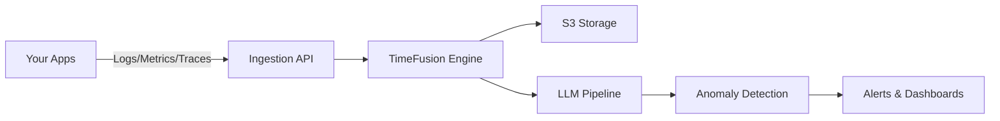

<div align="center">

<picture>
  <source media="(prefers-color-scheme: dark)" srcset="/static/public/assets/svgs/logo_white.svg">
  <source media="(prefers-color-scheme: light)" srcset="/static/public/assets/svgs/logo_black.svg">
  
</picture>

### Open-source monitoring that understands your systems

Monoscope uses AI to automatically detect anomalies in your logs, metrics, and traces. Query in natural language, store years of data affordably in S3, and reduce alert fatigue by 90%.

[](https://github.com/monoscope-tech/monoscope/releases)
[](LICENSE)
[](https://www.haskell.org/)
[](https://discord.gg/monoscope)

[**Website**](https://monoscope.tech) • [**Discord**](https://discord.gg/monoscope) • [**Twitter**](https://twitter.com/monoscope) • [**Documentation**](https://docs.monoscope.tech)

</div>

<div align="center" style="margin-top: 1em; margin-bottom: 1em;">
<a href="#-what-is-monoscope">🚀 What is Monoscope?</a> • <a href="#️-quick-start">🛠️ Quick Start</a> • <a href="#-integration">📊 Integration</a><br>
<a href="#-ai-anomaly-detection">🤖 AI Anomaly Detection</a> • <a href="#-natural-language-queries">💬 Natural Language Search</a> • <a href="https://github.com/monoscope-tech/monoscope">⭐ Star Us</a> • <a href="#-community">🤝 Contributing</a>
</div>

<br />

<div align="center">
  
</div>

## What is Monoscope?

AI-powered observability platform that automatically detects anomalies in your logs, metrics, and traces. Query in natural language, store data affordably in S3, and get alerts that matter.

**Key features:**

- 🤖 AI anomaly detection without configuration
- 💬 Natural language search
- 📊 OpenTelemetry native (750+ integrations)
- 💰 Cost-effective S3 storage
- ⚡ Built for scale with TimeFusion engine

## Quick Start

```bash
git clone https://github.com/monoscope-tech/monoscope.git
cd monoscope
docker-compose up
```

Visit `http://localhost:8080` (default: admin/changeme)

### Send Test Data

Populate your dashboard with test telemetry:

```bash
# Install telemetrygen
go install github.com/open-telemetry/opentelemetry-collector-contrib/cmd/telemetrygen@latest

# Send test traces (replace YOUR_API_KEY from the UI)
telemetrygen traces --otlp-endpoint localhost:4317 --otlp-insecure \
  --otlp-header 'Authorization="Bearer YOUR_API_KEY"' --traces 10
```

## Integration

### Auto-instrument your apps

<details>
<summary><b>Python</b></summary>

```bash
pip install opentelemetry-distro opentelemetry-exporter-otlp
opentelemetry-bootstrap -a install
OTEL_SERVICE_NAME="my-app" \
OTEL_EXPORTER_OTLP_ENDPOINT="http://localhost:4317" \
opentelemetry-instrument python myapp.py
```

</details>

<details>
<summary><b>Node.js</b></summary>

```bash
npm install --save @opentelemetry/auto-instrumentations-node
OTEL_SERVICE_NAME="my-app" \
OTEL_EXPORTER_OTLP_ENDPOINT="http://localhost:4317" \
node --require @opentelemetry/auto-instrumentations-node/register app.js
```

</details>

<details>
<summary><b>Java</b></summary>

```bash
curl -L https://github.com/open-telemetry/opentelemetry-java-instrumentation/releases/latest/download/opentelemetry-javaagent.jar -o otel-agent.jar
OTEL_SERVICE_NAME="my-app" \
OTEL_EXPORTER_OTLP_ENDPOINT="http://localhost:4317" \
java -javaagent:otel-agent.jar -jar myapp.jar
```

</details>

<details>
<summary><b>Kubernetes</b></summary>

```bash
# Install OpenTelemetry Operator
kubectl apply -f https://github.com/open-telemetry/opentelemetry-operator/releases/latest/download/opentelemetry-operator.yaml

# Configure auto-instrumentation
kubectl apply -f - <<EOF
apiVersion: opentelemetry.io/v1alpha1
kind: Instrumentation
metadata:
  name: my-instrumentation
spec:
  exporter:
    endpoint: http://monoscope:4317
  propagators:
    - tracecontext
    - baggage
EOF

# Annotate your deployments for auto-instrumentation
kubectl patch deployment my-app -p \
  '{"spec":{"template":{"metadata":{"annotations":{"instrumentation.opentelemetry.io/inject-java":"my-instrumentation"}}}}}'
```

</details>

## Natural Language Queries

Ask questions in plain English:

- "Show me all errors in the payment service in the last hour"
- "What caused the spike in response time yesterday?"
- "Which services are consuming the most memory?"

## AI Anomaly Detection

Monoscope's AI continuously learns your system's behavior patterns and alerts you to genuine issues without configuration:

- **Context-aware**: Understands that high CPU during deployments is normal, but not at 3 AM
- **Pattern recognition**: Learns daily, weekly, and monthly patterns automatically
- **Cross-signal correlation**: Analyzes logs, metrics, and traces together for deeper insights

## Architecture



## How It Compares

| Feature              | Monoscope   | Datadog   | Elastic | Prometheus |
| -------------------- | ----------- | --------- | ------- | ---------- |
| AI Anomaly Detection | ✅ Built-in | ❌ Add-on | ❌      | ❌         |
| Natural Language     | ✅          | ❌        | ❌      | ❌         |
| S3 Storage           | ✅          | ❌        | ✅      | ✅         |
| Open Source          | ✅          | ❌        | ✅      | ✅         |
| Setup Time           | 2 min       | Hours     | Hours   | Hours      |

## Screenshots

<table>
  <tr>
    <td width="50%">
      
      <p align="center"><i>Log Explorer</i></p>
    </td>
    <td width="50%">
      
      <p align="center"><i>Dashboard Analytics</i></p>
    </td>
  </tr>
</table>

## Users

<div align="center">
   &nbsp;
   &nbsp;
   &nbsp;
   &nbsp;
  
</div>

> "Monoscope notifies us about any slight change on the system. Features that would cost us a lot more elsewhere." — **Samuel Joseph, Woodcore**

## Documentation

- [Getting Started Guide](docs/getting-started.md)
- [Configuration](docs/configuration.md)
- [Kubernetes Guide](docs/kubernetes.md)
- [Development Guide](DEVELOPMENT.md)

## Community

💬 [Discord](https://discord.gg/monoscope) • 🐛 [Issues](https://github.com/monoscope-tech/monoscope/issues) • 🐦 [Twitter](https://twitter.com/monoscope)

## License

MIT License. See [LICENSE](LICENSE) for details.

---

<div align="center">
  <a href="https://github.com/monoscope-tech/monoscope"></a>
</div>

