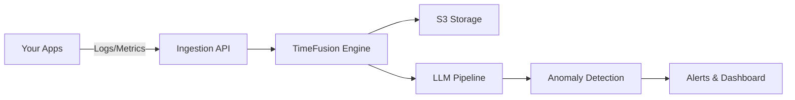

<div align="center">

<picture>
  <source media="(prefers-color-scheme: dark)" srcset="/static/public/assets/svgs/logo_white.svg">
  <source media="(prefers-color-scheme: light)" srcset="/static/public/assets/svgs/logo_black.svg">
  
</picture>

### Open-source monitoring and observability platform that understands your systems

Monoscope lets you ingest and explore your logs, traces and metrics in S3 buckets. Query in natural language via LLMs. Monoscope also let's you create AI agents that run at an interval to automatically detect anomalies in your logs, metrics, and traces. The most important actions and logs and insight are sent as reports to your email every day or week.

[](https://github.com/monoscope-tech/monoscope/releases)
[](LICENSE)
[](https://www.haskell.org/)
[](https://discord.gg/monoscope)

</div>

<p align="center">
    <a href="https://monoscope.tech"><b>Website</b></a> •
    <a href="https://discord.gg/monoscope"><b>Discord</b></a> •
    <a href="https://twitter.com/monoscope"><b>Twitter</b></a> •
    <a href="https://github.com/monoscope-tech/monoscope/releases"><b>Changelog</b></a> •
    <a href="https://docs.monoscope.tech"><b>Documentation</b></a>
</p>

<div align="center" style="margin-top: 1em; margin-bottom: 1em;">
<a href="#-what-is-monoscope">🚀 What is Monoscope?</a> • <a href="#️-quick-start-installation">🛠️ Quick Start Installation</a> • <a href="#-ingesting-logs-metrics--traces">📊 Ingesting Logs, Metrics & Traces</a><br>
<a href="#-ai-anomaly-detection">🤖 AI Anomaly Detection</a> • <a href="#-natural-language-search">💬 Natural Language Search</a> • <a href="https://github.com/monoscope-tech/monoscope">⭐ Star Us</a> • <a href="#-contributing">🤝 Contributing</a>
</div>

<br />

<div align="center">
  
  <p><i>Monoscope automatically detects anomalies in your logs, metrics, and traces using AI — no configuration required.</i></p>
</div>

## 🚀 What is Monoscope?

Monoscope is an open-source observability platform that uses artificial intelligence to understand and monitor your systems automatically. Unlike traditional monitoring tools that require extensive configuration and generate overwhelming alerts, Monoscope learns your system's normal behavior and only alerts you when something is genuinely wrong.

### Key Capabilities

- **Universal Data Ingestion**: Native support for OpenTelemetry means compatibility with 750+ integrations out of the box
- **AI-Powered Understanding**: Our LLM engine understands context, not just thresholds
- **Natural Language Interface**: Query your data in plain English
- **Cost-Effective Storage**: Store years of data affordably with S3-compatible object storage
- **Zero Configuration**: Start getting insights immediately without complex setup

## 🛠️ Quick Start Installation

```bash
# Run with Docker (recommended)
docker run -p 8080:8080 monoscope/monoscope:latest

# Or clone and run locally
git clone https://github.com/monoscope-tech/monoscope.git
cd monoscope
docker-compose up
```

Visit `http://localhost:8080` to access Monoscope.

## 📊 Ingesting Logs, Metrics & Traces

Monoscope is built on **OpenTelemetry**, the industry-standard observability framework. This means you get instant compatibility with **750+ integrations** including all major languages, frameworks, and infrastructure components.

### Supported Data Types

- **Logs**: Application logs, system logs, audit trails
- **Metrics**: Performance counters, business KPIs, custom metrics
- **Traces**: Distributed request flows, latency tracking, dependency mapping

### Quick Integration Examples

```bash
# For Python applications
pip install opentelemetry-api opentelemetry-sdk
export OTEL_EXPORTER_OTLP_ENDPOINT="http://localhost:8080"

# For Node.js applications
npm install @opentelemetry/api @opentelemetry/sdk-node
export OTEL_EXPORTER_OTLP_ENDPOINT="http://localhost:8080"

# For Kubernetes clusters
helm install opentelemetry-collector open-telemetry/opentelemetry-collector \
  --set config.exporters.otlp.endpoint="monoscope:8080"
```

Monoscope automatically correlates logs, metrics, and traces from the same service, giving you a complete picture of your system's behavior. No manual correlation or configuration required.

### Testing with Telemetrygen

Send test telemetry data to validate your setup:

```bash
# Install telemetrygen
go install github.com/open-telemetry/opentelemetry-collector-contrib/cmd/telemetrygen@latest

# Send test traces with your API key
telemetrygen traces --otlp-endpoint localhost:4317 \
  --otlp-insecure \
  --otlp-header 'Authorization="Bearer YOUR_API_KEY"' \
  --traces 10 --duration 5s
```

## 🤖 AI Anomaly Detection

Monoscope's AI engine continuously learns your system's normal behavior patterns and automatically alerts you to genuine issues:

- **Context-Aware Detection**: Understands that high CPU during deployments is normal, but high CPU at 3 AM is not
- **Seasonal Pattern Recognition**: Learns daily, weekly, and monthly patterns in your data
- **Cross-Signal Correlation**: Detects anomalies by analyzing logs, metrics, and traces together
- **Noise Reduction**: Reduces alert fatigue by 90% compared to threshold-based monitoring

The AI runs continuously in the background, requiring no configuration or training from you.

## 💬 Natural Language Search

Query your observability data using plain English instead of complex query languages:

### Example Queries

- "Show me all errors in the payment service in the last hour"
- "What caused the spike in response time yesterday at 3 PM?"
- "Which services are consuming the most memory?"
- "Find all database queries taking longer than 1 second"

Monoscope translates your natural language into optimized queries across logs, metrics, and traces, returning relevant results with explanations.

## 🎯 Key Features

<table>
  <tr>
    <td width="50%">
      <h4>🤖 AI-Powered Anomaly Detection</h4>
      <p>LLM-based engine that understands context and identifies real issues, not just threshold violations</p>
    </td>
    <td width="50%">
      <h4>💬 Natural Language Queries</h4>
      <p>Search logs and metrics using plain English - no complex query languages required</p>
    </td>
  </tr>
  <tr>
    <td width="50%">
      <h4>⚡ Built for Scale</h4>
      <p>Handle millions of events/sec with our custom TimeFusion storage engine</p>
    </td>
    <td width="50%">
      <h4>💰 Cost-Effective Storage</h4>
      <p>Store years of data affordably with S3-compatible object storage</p>
    </td>
  </tr>
</table>

## 📸 Screenshots

<div align="center">
<table>
  <tr>
    <td width="50%">
      
      <p align="center"><i>Log Explorer - Main View</i></p>
    </td>
    <td width="50%">
      
      <p align="center"><i>Log Explorer - Detailed View</i></p>
    </td>
  </tr>
  <tr>
    <td width="50%">
      
      <p align="center"><i>Dashboard Analytics</i></p>
    </td>
    <td width="50%">
      <picture>
        <source media="(prefers-color-scheme: dark)" srcset="/static/public/assets/svgs/logo_white.svg">
        <source media="(prefers-color-scheme: light)" srcset="/static/public/assets/svgs/logo_black.svg">
        
      </picture>
      <p align="center"><i>Monoscope - Open Source Observability</i></p>
    </td>
  </tr>
</table>
</div>

## 🏗️ Architecture Overview

Monoscope combines high-performance data ingestion with intelligent AI analysis:



- **Language**: Built in Haskell for reliability and performance
- **Storage**: S3-compatible object storage for cost-effective retention
- **AI Engine**: State-of-the-art LLMs for intelligent analysis
- **Scale**: Horizontally scalable architecture

## 🌟 Why Monoscope?

### The Problem

Traditional monitoring tools require extensive configuration, generate overwhelming alerts, and still miss critical issues. You spend more time managing your monitoring than actually using it.

### Our Solution

Monoscope uses AI to understand your system's behavior, automatically detect anomalies, and provide actionable insights - all without complex configuration.

### Who Uses Monoscope?

- **DevOps Teams** reducing alert fatigue by 90%
- **SREs** catching issues before they impact users
- **Engineering Leaders** getting visibility across complex systems
- **Startups** implementing enterprise-grade observability on a budget

## 🏢 Companies That Use Us

Trusted by 5000+ developers at proactive engineering companies including:

<div align="center">
  <table>
    <tr>
      <td align="center" width="25%">
        
        <br />
        <sub><b>GrovePay</b></sub>
      </td>
      <td align="center" width="25%">
        
        <br />
        <sub><b>SameDay</b></sub>
      </td>
      <td align="center" width="25%">
        
        <br />
        <sub><b>Platnova</b></sub>
      </td>
      <td align="center" width="25%">
        
        <br />
        <sub><b>PayFonte</b></sub>
      </td>
    </tr>
    <tr>
      <td align="center" width="25%">
        
        <br />
        <sub><b>ThePeer</b></sub>
      </td>
      <td align="center" width="25%">
        
        <br />
        <sub><b>BlockRadar</b></sub>
      </td>
      <td align="center" width="25%">
        
        <br />
        <sub><b>Partna</b></sub>
      </td>
      <td align="center" width="25%">
        <!-- Empty cell for alignment -->
      </td>
    </tr>
  </table>
</div>

### What Our Users Say

> "The best observability tool we use today at Woodcore, monoscope notifies us about any slight change that happens on the system. Most especially, for the features we utilise today on monoscope, would cost us a lot more elsewhere."
>
> **— Samuel Joseph**, Woodcore

> "Monoscope has transformed how we handle monitoring at Community Fluency. The AI-powered insights save us hours every week."
>
> **— Lazarus Morrison**, Founder of Community Fluency

## 📚 Documentation

- [Features](#features)
- [Prerequisites](#prerequisites)
- [Installation](#installation)
- [Development Setup](#development-setup)
- [Testing](#-testing)
- [Contributing](#-contributing)
- [License](#-license)

---

## Features

- 🤖 **AI-Powered Anomaly Detection**: Leverages LLMs to automatically identify and alert on unusual patterns
- ☁️ **S3-Compatible Storage**: Store logs, metrics and traces in any S3-compatible object storage
- 🚀 **High Performance**: Written in Haskell and rust for reliability and performance
- 📈 **Real-Time Analytics**: Monitor your systems with minimal latency
- 🔌 **Extensible**: Easy to integrate with existing monitoring infrastructure

### Getting Started

- [Installation Guide](docs/installation.md)
- [Configuration](docs/configuration.md)
- [Architecture Deep Dive](docs/architecture.md)

### Tutorials

- [5-Minute Quick Start](docs/quickstart.md)
- [Monitoring Kubernetes](docs/kubernetes.md)
- [Alert Configuration](docs/alerts.md)

## 🛠️ Installation

<details>
<summary><strong>Prerequisites</strong></summary>

### Prerequisites

Before installing Monoscope, ensure you have the following dependencies:

- **Haskell**: Install via GHCup
- **PostgreSQL with TimescaleDB**: For time-series data storage
- **LLVM**: Required for compilation
- **Google Cloud SDK**: For GCP integration (if using GCP)

### Installation

1. **Install Haskell via GHCup**

```bash
curl --proto '=https' --tlsv1.2 -sSf https://get-ghcup.haskell.org | sh
```

2. **Clone the Repository**

```bash
git clone https://github.com/monoscope-tech/monoscope.git
cd monoscope
```

3. **Install System Dependencies**

**For macOS:**

```bash
# Install LLVM
brew install llvm

# Install PostgreSQL with TimescaleDB
brew install postgresql
brew install timescaledb

# Install libpq
brew install libpq
```

**For Linux (Ubuntu/Debian):**

```bash
# Install LLVM
sudo apt-get install llvm

# Install PostgreSQL and TimescaleDB
# Follow instructions at: https://docs.timescale.com/install/latest/

# Install libpq
sudo apt-get install libpq-dev
```

4. **Configure Google Cloud (Optional)**

If using Google Cloud integration:

```bash
gcloud auth application-default login
```

5. **Run Monoscope**

```bash
stack run
```

</details>

<details>
<summary><strong>Development Setup</strong></summary>

## Development Setup

### Database Setup with Docker

1. **Create a Docker volume for PostgreSQL data:**

```bash
docker volume create pgdata
```

2. **Run TimescaleDB in Docker:**

```bash
make timescaledb-docker
```

3. **Configure pg_cron extension:**

Add the following to your PostgreSQL configuration:

```sql
ALTER system SET cron.database_name = 'monoscope';
ALTER system SET shared_preload_libraries = 'pg_cron';
```

Then restart the TimescaleDB Docker container.

### Development Tools

**Install code formatting and linting tools:**

```bash
# Code formatter
brew install ormolu

# Linter
brew install hlint
```

**Useful commands:**

```bash
# Format code
make fmt

# Run linter
make lint
```

💡 **Tip**: For better IDE support, compile Haskell Language Server locally to avoid crashes, especially on macOS. See [issue #2391](https://github.com/haskell/haskell-language-server/issues/2391).

### Service Worker

To build the service worker:

```bash
workbox generateSW workbox-config.js
```

</details>

## 🧪 Testing

<details>
<summary><strong>Running Tests</strong></summary>

### Run all tests

```haskell
make test
# OR
stack test --ghc-options=-w
```

### Run only unit tests

Unit tests don't require a database connection and run much faster. They include doctests and pure function tests.

```haskell
make test-unit
# OR
stack test monoscope-server:unit-tests --ghc-options=-w
```

### Run unit tests with file watching for development

```haskell
make live-test-unit
# OR
stack test monoscope-server:unit-tests --ghc-options=-w --file-watch
```

### Run a specific individual test

```haskell
stack test --test-arguments "--match=SeedingConfig" monoscope-server:tests
# OR
stack test --ta "--match=SeedingConfig" monoscope-server:tests
```

</details>

## 🤝 Community

- 💬 [Discord](https://discord.gg/monoscope) - Chat with users and contributors
- 🐛 [Issues](https://github.com/monoscope-tech/monoscope/issues) - Report bugs or request features
- 🐦 [Twitter](https://twitter.com/monoscope) - Follow for updates
- 📝 [Blog](https://blog.monoscope.tech) - Tutorials and case studies

## 🌍 Contributing

We welcome contributions to Monoscope! Please feel free to:

- Report bugs and request features via [GitHub Issues](https://github.com/monoscope-tech/monoscope/issues)
- Submit pull requests for bug fixes and new features
- Improve documentation and examples
- Share your use cases and feedback

Before contributing, please read our contributing guidelines and ensure your code passes all tests and linting checks.

## 📄 License

Monoscope is open source software. Please see the LICENSE file for details.

## 🚀 Roadmap

- [ ] Kubernetes Operator
- [ ] Terraform Provider
- [ ] Mobile App
- [ ] Distributed Tracing Support
- [ ] Custom ML Model Training

See our [public roadmap](https://github.com/monoscope-tech/monoscope/projects) for more details.

## 🏆 Comparisons

| Feature                 | Monoscope   | Datadog        | Elastic | Prometheus |
| ----------------------- | ----------- | -------------- | ------- | ---------- |
| AI Anomaly Detection    | ✅ Built-in | ❌ Add-on      | ❌      | ❌         |
| Natural Language Search | ✅          | ❌             | ❌      | ❌         |
| Cost-Effective Storage  | ✅ S3       | ❌ Proprietary | ✅      | ✅         |
| No Configuration Alerts | ✅          | ❌             | ❌      | ❌         |
| Open Source             | ✅          | ❌             | ✅      | ✅         |

---

<div align="center">
  <h3>Ready to transform your observability?</h3>
  <a href="https://github.com/monoscope-tech/monoscope"></a>
  <br />
  <sub>Built with ❤️ by the <a href="https://monoscope.tech">Monoscope</a> team</sub>
</div>
