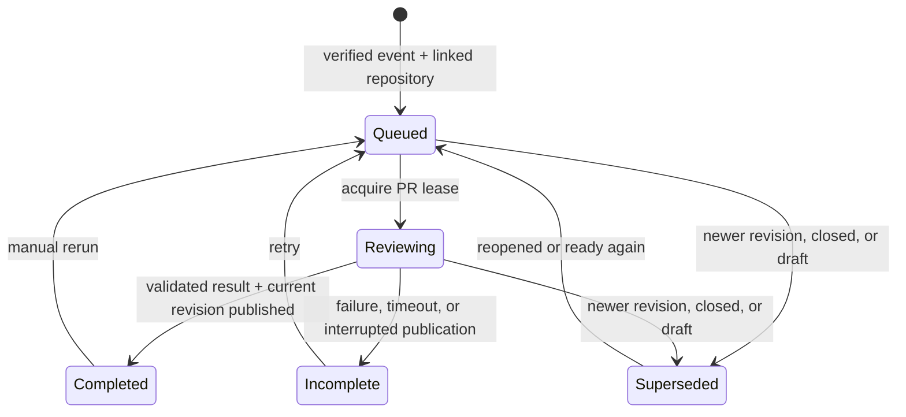

# Production impact reviews: rollout and follow-up

## Review contract

- Every GitHub App repository added through code mappings is eligible by default,
  including mappings without a service. Dashboard sync configuration is not required.
  A shared repository receives a separate, project-labelled comment per project;
  evidence is never combined across projects.
- Signed `opened`, `synchronize`, `reopened`, and `ready_for_review` events queue
  background reviews. Draft and closed events invalidate pending publication.
  Duplicate deliveries reuse a revision run; newer events supersede older work.
  A worker encountering a duplicate lease returns quietly; a newer revision is deferred
  until the active lease expires. Leases last three minutes for a two-minute worker budget.
- Each review reads a bounded diff (30 files, 2,000 characters per patch), seven
  days of event/error aggregates for explicitly mapped services, and bounded monitor
  and dashboard query references. Missing mappings, missing telemetry, query failures,
  and truncated diffs produce explicit coverage gaps. No raw log bodies are collected.
- Model findings must cite a changed line and server-supplied telemetry evidence.
  The server derives the verdict. This release only publishes “Worth checking”,
  “Coverage unknown”, or “No finding”; it does not claim a proven production break.
  Service-level context does not prove a changed-path or deployed-revision match.
- One App-owned summary comment per project is updated in place. Publication rechecks
  the PR head, base, open/draft status, project grant, repository setting, and lease.
  A retry discovers existing App-owned comments by project marker before posting.
  Pure documentation-only revisions complete silently; an earlier comment still
  identifies the revision it reviewed.
- Repositories exposes per-repository review settings under Configure source context,
  with recent results and rerun under Pull requests. Links-only is the default;
  production aggregates require an explicit opt-in. Query text is never rendered in comments.
  Writes require edit permission.
  Links-only comments omit generated production prose, counts, service/environment
  labels, and query text; evidence URLs still identify the linked Monoscope query.

### Enable the GitHub App

1. Apply migrations `0213_pr_impact_reviews.sql` and `0214_pr_review_evidence_optin.sql`
   through the normal startup migrator.
2. Configure `GITHUB_APP_ID`, `GITHUB_APP_NAME`, `GITHUB_APP_PRIVATE_KEY` (base64 PEM),
   `GITHUB_CLIENT_ID`, `GITHUB_CLIENT_SECRET`, and `GITHUB_APP_WEBHOOK_SECRET` from
   the same GitHub App registration. The secret must match the GitHub App webhook secret;
   dashboard-sync repository secrets are separate.
3. Set the App webhook URL to `/webhook/github` on the public Monoscope host, enable
   pull request events, and grant repository **Contents: read** and
   **Pull requests: read and write**. Existing installations must accept updated
   permissions ([GitHub permission reference](https://docs.github.com/en/rest/issues/comments#create-an-issue-comment)). The App needs access to each source repository added to the project.
4. Set both the App setup URL and user authorization callback URL to
   `<public Monoscope host>/github/callback`, matching `HOST_URL`. Apply migration
   `0220_github_installation_authorization.sql` through the startup migrator.
   Start connections from **Repositories → Add repositories → Connect GitHub account**.
   A project editor who owns the personal account or is an active organization owner
   must authorize the connection. Monoscope verifies the installation with that user's
   access token before sharing the account with the project; the user token is not saved.
   Connection requests expire after 15 minutes and cannot be reused. Direct setup links
   without a request must be restarted from Repositories
   ([GitHub setup URL security](https://docs.github.com/en/apps/creating-github-apps/registering-a-github-app/about-the-setup-url)).
5. Select repositories and link their services under **Configure source context**. Open or
   update a ready PR, then check its review history and GitHub comment. Existing
   open PRs are not backfilled until an event is received.

### Remaining scope

- Automatic repository/service/path and deployed-revision discovery.
- Direct instrumentation-name/attribute continuity proof and service-scoped monitor/dashboard references using parsed query dependencies.
- Latency/metric, issue, trace, endpoint, and deployment evidence beyond service counts.
- Optional GitHub check runs, user feedback, short-lived evidence caching, and retention/cost controls.
- Daily scans, project memory, and on-demand reliability reports.

## Review decisions

- GitHub metadata is read before and after diff retrieval, then before publication.
  These checks prevent concurrent pushes from mixing revisions or publishing stale findings.
- Telemetry reads honor the TimeFusion reader configuration. Postgres remains a temporary
  fallback during the TF migration; the reviewer adds no PG reconciliation path.
- Monitor/dashboard references are project-wide candidates. They do not prove service
  ownership or an instrumentation dependency. Service-scoped matching remains follow-up work.
- Evidence collection has bounded output but no cache yet; dashboard query extraction can
  scan all dashboards in a project. Add caching/indexing when project size warrants it.
- Migration 0214 changes the evidence default without overwriting explicit existing choices.
- The test PEM is generated solely for fake GitHub App JWT tests and is not registered with an App.
- GitHub supplies bounded, potentially truncated patch hunks. The small changed-line reader
  accepts partial hunks; replacing it with a complete-patch parser must preserve that behavior.
