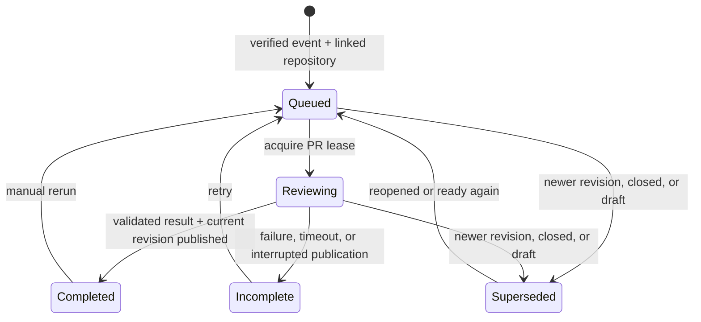
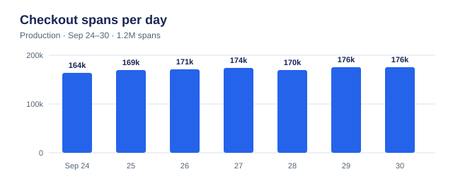

# Production impact reviews — working scope (2026-09-30)

Status: automatic advisory PR reviews implemented for linked GitHub App source
repositories. The broader daily scan and on-demand reliability report remain planned.

## First release implementation (2026-10-09)

- Every GitHub App repository added through code mappings is eligible by default,
  including mappings without a service. Dashboard sync configuration is not required.
  A shared repository receives a separate, project-labelled comment per project;
  evidence is never combined across projects.
- Signed `opened`, `synchronize`, `reopened`, and `ready_for_review` events queue
  background reviews. Draft and closed events invalidate pending publication.
  Duplicate deliveries reuse a revision run; newer events supersede older work.
- Each review reads a bounded diff (30 files, 2,000 characters per patch), seven
  days of event/error aggregates for explicitly mapped services, and bounded monitor
  and dashboard query references. Missing mappings, missing telemetry, query failures,
  and truncated diffs produce explicit coverage gaps. No raw log bodies are collected.
- Model findings must cite a changed line and server-supplied telemetry evidence.
  The server derives the verdict. This release only publishes “Worth checking”,
  “Coverage unknown”, or “No finding”; it does not claim a proven production break.
  Service-level context does not prove a changed-path or deployed-revision match.
- One App-owned summary comment per project is updated in place. Publication rechecks
  the PR head, base, open/draft status, project grant, repository setting, and lease.
  A retry discovers existing App-owned comments by project marker before posting.
  Pure documentation-only revisions complete silently; an earlier comment still
  identifies the revision it reviewed.
- Settings → Integrations → Source Code exposes per-repository enable/disable, aggregates-and-links
  versus links-only output, recent results, and rerun. Writes require edit permission.
  Links-only comments omit generated production prose, counts, service/environment
  labels, and query text; evidence URLs still identify the linked Monoscope query.

### Enable the GitHub App

1. Apply migration `0213_pr_impact_reviews.sql` through the normal startup migrator.
2. Configure `GITHUB_APP_ID`, `GITHUB_APP_PRIVATE_KEY` (base64 PEM), and
   `GITHUB_APP_WEBHOOK_SECRET`. The secret must match the GitHub App webhook secret;
   dashboard-sync repository secrets are separate.
3. Set the App webhook URL to `/webhook/github` on the public Monoscope host, enable
   pull request events, and grant repository **Contents: read** and
   **Pull requests: read and write**. Existing installations must accept updated
   permissions ([GitHub permission reference](https://docs.github.com/en/rest/issues/comments#create-an-issue-comment)). The App needs access to each source repository added to the project.
4. Add source repositories in Source Code settings and map services when known. Open or
   update a ready PR, then check its review history and GitHub comment. Existing
   open PRs are not backfilled until an event is received.

### Remaining scope

- Automatic repository/service/path and deployed-revision discovery.
- Direct instrumentation-name/attribute continuity proof using parsed query dependencies.
- Latency/metric, issue, trace, endpoint, and deployment evidence beyond service counts.
- Optional GitHub check runs, user feedback, and retention/cost controls.
- Daily scans, project memory, and on-demand reliability reports.

The following sections retain the broader product contract and backlog. They are
not a claim that those later stages are shipped.

## Outcome

For a connected repository, Monoscope reviews each new pull request revision against
the project's production evidence. It calls out changes that may break observability,
reliability, or performance, and shows why the affected path matters. It does not
review syntax, style, or other code trivia.

The reviewer separates three claims:

1. **Observed:** what logs, metrics, traces, issues, or deployments actually show.
2. **Inferred:** the effect the proposed diff could have, with the mechanism and
   uncertainty stated.
3. **Unknown:** what missing mapping, instrumentation, or history prevents a conclusion.

Pre-merge telemetry establishes current behavior and impact. It cannot by itself
prove the proposed code will fail after merge.

Polylane's impact review sets a useful bar: one comment updated per push, a
changed line tied to live production evidence, and an optional blocking check.
It passes when a concrete break cannot be proved. Monoscope should keep that
high bar for an **action needed** finding, while naming unknown coverage
explicitly because blind spots are part of this product's purpose. A PR aimed
at an existing issue should also say whether the changed path plausibly fixes
that issue, with the same observed/inferred distinction.

## Customer workflow

1. Connect the existing GitHub App to a Monoscope project. Working assumption:
   repositories granted to that installation start receiving reviews without
   another Monoscope form. The member can disable reviews for a repository.
2. Monoscope proposes repository-to-service mappings from available source,
   deployment, and telemetry metadata. It shows ambiguous mappings as missing
   coverage until a user resolves them; they do not silently prevent a review.
3. PR events automatically queue a review for the latest head commit. A later commit supersedes
   an unfinished review. The GitHub output identifies the reviewed commit.
4. One PR summary is updated in place. The review is advisory at launch; whether
   customers can make a check required is an open decision.
5. A user can correct a mapping, disable reviews for a repository, and rerun a review.
6. The project's settings control whether production evidence is included in
   GitHub comments. It is included by default; the alternative posts the
   verdict and links while keeping production details in Monoscope.

Existing code context mappings can seed step 2, but today they are entered by the
customer and an optional service means a repository may match several services.
They improve a review; they do not gate it. Automatic setup therefore needs a
visible mapping result, not an assumed match.
The project page should show each eligible repository's review state and inferred
services, with a one-step correction for an ambiguous or missing service. A
repository can still receive a coverage-unknown review before that correction.
If one installation or repository is connected to several Monoscope projects,
the publishing owner needs an explicit rule; do not silently combine projects'
telemetry in a single GitHub comment.

### Proposed first release slice (pending product choices)

Start with connected GitHub source repositories and observability continuity:
changed instrumentation, service identity, attributes, and names that existing
telemetry, monitors, or dashboards depend on. Include a blind-spot finding when
the changed path cannot be mapped to a service or measured. This yields a
specific, testable review promise before expanding to reliability and performance
claims. Keep the broader finding families in the review contract below.

For each PR head revision: verify the delivery and project/repository grant;
load the changed files and current mapping; collect bounded telemetry and
monitor/dashboard references; build structured observed/inferred/unknown
findings; publish one comment for that revision; and store the run and its
evidence links. Repeated deliveries reuse the same run. A new head supersedes
older work, and an older worker cannot overwrite the newer comment. If a query
fails, the comment reports incomplete coverage rather than a clean verdict.

Use the existing project AI and routine surfaces for related investigations,
but keep the review run separate from a chat transcript. Project memory is
retrieved before evidence collection and updated only after a sourced finding
is confirmed. This is a proposed rollout sequence, not a product decision yet.

Proposed delivery order: (1) project-scoped evidence links, memory, and verified
GitHub delivery; (2) automatic PR reviews with an advisory comment and check;
(3) daily codebase scans using the same evidence path; (4) on-demand reliability
reports with Monoscope signals; (5) CloudWatch, Datadog, and Sentry adapters.
Each stage has an end-to-end acceptance case below. The final scope includes
all five stages; launch grouping and order remain open to the customer priority.

## Review contract

Every finding contains a changed file and line, a concrete failure mechanism,
the affected service or endpoint, the measured production context, and the next
check or fix. It cites direct links to Monoscope evidence with explicit time range
and environment. A claim that a change *will* break production needs stronger
proof than a historical correlation.

### Evidence join and confidence

- **Direct dependency:** a changed telemetry name or attribute appears in an
  existing monitor or dashboard query, and production data confirms the old
  signal is emitted by the mapped service. Show the exact query reference,
  changed line, time window, and whether a query covering both names would keep
  historical data visible after the change.
  This can support an action-needed finding about continuity.
- **Mapped service:** the repository is linked to a service, but the specific
  changed path has no known runtime link. Show that service's traffic, issues,
  and representative traces as context; label the path-to-impact link as
  inferred. High traffic alone does not prove the diff will cause a failure.
- **Repository only:** the App can read the diff, but a catch-all code mapping,
  missing deployment revision, or ambiguous services prevent a sound production
  join. Publish coverage unknown and a one-step mapping action. Do not present
  another service's trace as proof for this PR.

Revision evidence matters separately from service mapping. A SHA-like
`service.version`, `vcs.repository.ref.revision`, or `git.commit.sha` can tie
observed telemetry to a deployed revision after the identifier is resolved
against the repository; a version string or a repository's current branch
cannot. A trace shown in the comment must name whether it comes
from the exact endpoint or only the mapped service. Query-reference detection
should use parsed KQL where possible; raw SQL or template-driven queries may
need an explicit unknown instead of a text-match verdict.

Initial finding families:

- **Observability break:** removing or renaming spans, logs, metric names, labels,
  trace correlation, service identity, or attributes used by existing charts,
  monitors, and investigations. Check whether old and new data would remain
  queryable as one historical series, or whether dashboards and baselines split.
  For a proposed rename, show whether a query that includes both names preserves
  the series and whether the affected monitor/chart can use it during migration.
  OpenTelemetry's semantic-convention migrations use dual emission as a phased
  option, which is a useful repair pattern to suggest when it fits.
- **Reliability impact:** a change to a path with meaningful live traffic,
  errors, open issues, incident history, or downstream dependencies; explain the
  diff's specific risk, not just that the path is busy.
- **Performance impact:** query, dependency, retry, timeout, or high-volume path
  changes with relevant latency, volume, or cost baselines.
- **Blind spot:** a changed path cannot be assessed because relevant telemetry,
  source mapping, deployment version, or trace linkage is absent.

The summary distinguishes **action needed**, **worth checking**, **coverage
unknown**, and **no finding**. “No finding” means the review completed with
adequate coverage; it is not a substitute for a failed query or absent data.
Documentation-only and test-only changes need no production finding. The review
must suppress duplicate or weak claims and state its evidence limits.

## Evidence shown in the PR

- A short impact statement and the changed line that motivated it.
- An embedded chart image with values, window, environment, units, and sample
  size, plus short relevant trace and historical issue context. The reviewer
  can understand the finding from the comment alone. Links open the
  interactive chart, trace, or issue for deeper inspection.
- A statement of what was observed versus inferred, plus missing coverage.

The default GitHub output includes bounded production aggregates, a short
sanitized trace excerpt when useful, and the relevant historical context.
The project can switch to links-only output. Neither mode posts raw log bodies,
secrets, or personal data. The embedded image is an immutable PNG chart snapshot,
with the same approved aggregates as the comment and no additional sensitive
data. GitHub cannot render images served behind authentication, and anyone
with an anonymized image URL may view it, so treat the snapshot as shareable
by URL. The links-only project setting suppresses both the chart and its
numbers in GitHub. Monoscope's existing widget PNG endpoint is unsuitable:
it is not a fixed snapshot, and the URL's time range is not covered by its
signature. Do not reuse it for PR evidence. GitHub CLI can attach images, but its documented
workflow requires repository push access; do not expand the App's repository
write permission solely to obtain chart attachments.

### Illustrative PR comment (fictional data)

> **Action needed · checkout-api · reviewed `abc1234`**
>
> `src/checkout/instrumentation.ts:84` replaces `http.route` with
> `route.name`. The checkout latency monitor and its dashboard still group by
> `http.route`. If the old attribute stops being emitted, those views will no
> longer match new spans, and their historical series will be split from new
> observations.
>
> **Observed:** 1.2 million checkout spans carried `http.route` in the last
> seven days; the monitor and dashboard both reference it. An incident on
> September 18 used this monitor. Daily volume: 164k · 169k · 171k ·
> 174k · 170k · 176k · 176k. A representative trace spans the checkout
> handler and payment call, both grouped under the old route attribute.
>
> 
>
> [Open interactive chart] · [View monitor] · [View trace]
>
> **Change to check:** keep the old attribute during migration, or update
> the monitor and dashboard with a query that covers both names. Verify a
> post-deploy span before removing the old name.

The real comment must link to exact project-scoped evidence and show its
time window. The example uses invented counts and a local SVG illustration;
publishing substitutes an immutable PNG snapshot URL for the local asset.

## Project memory

The reviewer, daily scan, chat, and incident investigations share memory
scoped to the Monoscope project. Conversation transcripts and run records stay
as history; they are not themselves trusted project memory.

- **Project briefing:** a short, editable overview of stable architecture,
  service boundaries, links to canonical repository-to-service mappings,
  telemetry conventions, and known operational rhythms. Agents read it at
  the start of a project task. They can propose a briefing update when new
  evidence changes that overview; the change and its source remain visible.
- **Fact records:** one sourced codebase fact, operational decision, or confirmed
  failure mode per record, tagged with service, repository, and environment.
  Examples are "checkout workers publish to this queue," "the team retains
  `http.route` during migration," and "this dependency times out during the
  morning import." Each record has a source (code revision and path, query and
  time window, trace, issue, deployment, or human author), an observed date,
  and a status: current, needs recheck, or archived. Agents retrieve relevant
  records when reviewing a changed path or investigating an issue.

Each review, scan, chat, or investigation can propose new facts or an update to
an existing one. Deduplicate by subject and claim before promotion. A record
becomes reusable memory automatically when its source confirms the claim;
members can correct it. A member's own decision or note is marked as authored
by that member, not presented as measured telemetry. A dismissed PR finding is
feedback, not proof of the opposite claim. Keep uncertain hypotheses in the run
record, where they remain accessible without becoming trusted memory.

Project members can browse, search, edit, pin, and archive records from a
project page, and export the briefing and records through a project-scoped API.
The PR reviewer, daily scan, chat, and incident investigator use the same
project-scoped search tool; agents see the record's source and status alongside
its text. A memory remains accessible even if its originating conversation is
deleted or hidden from the agent's current thread.
An edit keeps the earlier version and its source. A new deployment, changed
instrumentation, a change to the cited code path, contradictory telemetry, or
a broken source link marks the affected record for recheck; agents then verify
it against current code or live evidence before citing it. Do not duplicate
current telemetry values or repository contents as durable facts when the
source can be queried directly.

Memory retrieval must enforce project membership and project ID before search
or prompt assembly. A source record from one project never becomes context
for another. A PR comment may quote a memory only when its source and current
status support the specific claim.

This follows Polylane's confirmed, sourced memories and editable workspace
notes, LangGraph's separation of thread history from cross-thread memory,
and Letta's shared context blocks for information several agents need.
The project briefing is kept short; specific findings are retrieved when
relevant instead of loading an ever-growing transcript into every review.
Daily scan and review runs remain accessible as dated history; only durable,
confirmed conclusions are promoted into memory.

### Review engine and prior art

Use Monoscope's existing project-scoped agent and GitHub integration for the
first release. Add read-only, revision-pinned source tools and a bounded review
run that joins source changes to Monoscope evidence. Keep project memory in
Monoscope so review, scan, chat, and investigations read the same sourced facts.
An agent transcript or condensed context is run history, not project memory.

- OpenCodeReview's deterministic diff selection, related-file grouping,
  read-only code tools, coverage warnings, and final finding filter are useful
  review patterns. Its context compression only shortens one run; durable
  domain-specific memory is on its roadmap. Its default defect rules would
  need replacement with the production-impact contract here.
- PR-Agent shows how to maintain one updated PR comment, preserve finding
  state across reruns, expose review coverage, read trusted repository context
  from the default branch, and keep per-repository settings. Its repository
  instruction files and PR finding state can complement Monoscope memory but
  do not replace sourced, project-scoped facts shared across workflows.
- Pi offers an embeddable agent SDK, custom tools, and persistent sessions.
  It is a candidate for a separately deployed source-reading worker if the
  existing Haskell loop proves limiting. It adds a Node/Bun runtime and requires
  an external sandbox for filesystem, process, network, and credential access.
  Its session persistence serves transcripts rather than authoritative
  cross-workflow project memory.

The boundary remains stable if the review engine changes: supply a pinned PR
diff, bounded read-only source access, relevant memory records, and verified
telemetry evidence; receive structured observed/inferred/unknown findings with
source references. Monoscope validates the evidence, applies project policy,
and publishes the comment and chart snapshot.

## Daily codebase scan

Read each selected repository's current revision daily, even when no PR is open.
Reuse the same service mapping and evidence rules to find instrumentation gaps,
bad metadata, missing trace correlation, and performance regressions. Compare
code instrumentation with the signals Monoscope actually receives, and name
the affected service and code or configuration location. The result destination
and launch order relative to PR reviews are open.

The scan compares the current default-branch revision with the previous scan,
then checks candidates against recent production signals. Examples: a span or
log attribute emitted in code but absent from observed telemetry; missing
`service.name`, environment, version, or trace IDs in a measured share of
records; unstable labels that fragment a metric; and a code change near a
measured latency regression. A scan result includes the revision and source
location, affected service, sample size and time window, the observed defect,
the proposed fix, and what remains unknown. A code smell alone is a hypothesis,
not a confirmed production regression.

Deduplicate recurring results across days and recheck them after a fix or new
deployment. Keep a dated run record even when there is no new finding. Promote
only confirmed, durable findings into project memory. A missing source mapping,
unavailable telemetry, or an unscannable repository is reported as incomplete
coverage, not a clean scan.

## On-demand reliability check

A customer can request a check for problems their alerts missed. The agent
examines available telemetry, open issues, monitors, and recent changes,
then returns evidence-backed findings and the blind spots that prevented an
alert. CloudWatch, Datadog, and Sentry are possible additional sources; whether
they are required at launch is open. A connector must distinguish absent data,
permission failure, and a genuinely healthy result.

The check starts with the project's connected signals and a stated lookback
window. It finds concrete candidates such as a rising error group, a latency
or saturation regression, or an unhealthy dependency; compares each with a
relevant baseline; and inspects active monitors and incident history. Call a
problem **unalerted** only when the observed issue and alert gap are both
supported: no matching active monitor, a disabled or muted monitor, a threshold
that missed the observed data, or a delivery failure. Show the actual query,
chart, trace or issue, affected service, onset, and why the alert did not cover
it. An uncertain monitor match is stated as unknown, not as proof that no alert
exists.

The result is a project-scoped report with ranked findings, suggested monitor
or instrumentation changes, source links, and a coverage table for Monoscope
and each connected provider. Providers that are not connected remain explicit
gaps. Repeat runs compare with prior findings and do not repeatedly announce
the same unchanged problem. The customer can run it again after changing an
alert, then inspect whether the coverage gap closed.

## Technical starting point

- The GitHub App installation, credential, and repository picker already exist.
- `projects.code_mappings` links repositories to a project and optionally a
  service; deployment evidence and source reads use those mappings. Its current
  path mapping resolves stack-frame paths into repository files, not arbitrary
  changed files into runtime endpoints. A mapping with no service is a repo
  link, not evidence that every service in the project uses its code.
- Telemetry carries `service.name`, `service.version`, and trace IDs when the
  instrumented application emits them. The existing source-context logic also
  recognizes SHA-like revision attributes; semver alone is not a commit link.
  Monitor and dashboard KQL queries are available to inspect for signal
  dependencies, while raw SQL and query templates need separate handling.
- The GitHub webhook currently accepts push events for dashboard sync and ignores
  pull request events. It also looks up only the single dashboard-sync repository
  before verifying the delivery. Source repositories linked through
  `code_mappings` do not reach this handler's accepted path. The current GitHub
  verifier accepts a missing per-repository secret, so PR publishing needs a
  configured GitHub App webhook secret and signature verification before any
  project lookup or queued work. After verification, resolve the installation
  and repository to a linked project, then fetch, persist the run, and publish.
  Those are new paths. GitHub's App guidance recommends verifying webhook
  signatures and includes the installation ID in App deliveries.
- The source-code picker currently presents one preferred credential even though
  a project can hold several account grants. Auto setup must discover eligible
  repositories across the project's grants and show which installation owns
  each repository; an account that sorts or was installed most recently cannot
  silently determine the PR review target.
- The GitHub App will need PR read, PR comment write, and Checks write for the
  proposed advisory check. Treat expanded permissions as part of installation
  and upgrade UX.
- Existing agent tools can query telemetry, issues, incidents, endpoints,
  monitors, repositories, and deployments. The review needs bounded,
  project-scoped access and a structured evidence result before publishing.
- Existing project AI conversations and routine runs retain history, but no
  project-memory search or fact-promotion tool appears in the agent tool list.
  Shared briefing, fact records, their source/status, and scoped retrieval are
  new paths rather than more text appended to conversation metadata.
- Existing routine templates cover telemetry quality, gaps, correlation,
  performance, and deployment regressions; the daily scan should reuse their
  evidence logic where it applies. Those routines do not read a repository's
  current revision or track code findings across daily runs yet.
- No CloudWatch, Datadog, or Sentry provider client is present in the current
  server code. Reading those providers and evaluating their alert coverage are
  separate connector work; their names in the current UI/code are comparisons.

## Acceptance checks

- Installing the app with repository access is sufficient to start automatic
  reviews; an existing source mapping improves evidence without a second form.
  Ambiguous service mapping yields explicit coverage unknown.
- A source repository linked outside dashboard sync receives verified PR events.
  An unsigned delivery queues no review. Multiple account grants and a repository
  linked to several projects follow the chosen ownership rule without mixing
  project evidence.
- A PR open or head update produces one current review for that exact revision;
  duplicate deliveries do not produce duplicate comments.
- A finding can be traced from changed line to service to time-bounded
  production evidence. A reviewer can open every cited chart, issue, or trace.
- In full-evidence mode, the comment renders a chart image for each relevant
  time series with its window, environment, units, and sample size visible;
  the chart link remains available. In links-only mode it renders no aggregate
  numbers or chart image. Reopening the same PR later shows the same snapshot,
  and changing image URL parameters cannot broaden its time or project scope.
- A catch-all repository mapping does not turn unrelated services' telemetry
  into proof. A missing or non-SHA service version downgrades revision certainty,
  and a representative service trace is labeled as such.
- Missing telemetry, unmapped repos, query failures, and low sample sizes are
  visibly different from a clean result.
- A changed attribute used by a monitor or dashboard is caught in an end-to-end
  fixture, including its effect on older telemetry; a stylistic diff produces
  no finding.
- The daily scan identifies a known missing correlation or metadata defect in
  an end-to-end fixture and cites the affected service. A second unchanged run
  does not announce it again, while its dated run remains accessible.
- An on-demand check reports an unalerted issue with supporting telemetry and
  identifies the absent or ineffective monitor. Disconnected and failed
  providers appear as coverage gaps; rerunning after an alert change can show
  whether the gap closed.
- A confirmed finding from one run is available to a later PR review in the
  same project, with its source and status. It is absent from another project;
  a retracted or stale finding is not cited as current evidence.
- A sourced codebase fact learned in one scan is searchable by a project member
  and by a later agent run. Changing its cited code path marks it for recheck;
  deleting the originating conversation does not silently erase it.

Before making reviews a required check, measure review completion time,
repository-to-service coverage, evidence-link validity, duplicate comments,
findings engineers accepted or dismissed, and missed problems found after merge.
Review a sample of clean verdicts as well as flagged PRs; a low finding count
alone does not prove the reviewer is accurate.

## Recommended defaults and decisions to confirm

These defaults make the scope implementable without treating unanswered product
choices as agreed decisions.

| Choice | Working default | Reason to revisit |
| --- | --- | --- |
| Setup | Review all repositories granted to the project's GitHub App installation; allow a per-repository off switch. | A customer may grant repositories used only for dashboard sync or code context. |
| GitHub output | One updated comment with all evidence, plus a non-blocking check that mirrors its verdict. A project may later make the check required. | Extra Checks permission and launch complexity. |
| Service mapping | Infer from source mappings, deployment/version metadata, and telemetry. Show an explicit coverage gap when ambiguous, with one-step correction. | Some monorepos may need a path-to-service map. |
| Finding priority | Make observability continuity and blind spots excellent first, then expand to concrete reliability and performance impacts. Keep all families in the final product. | A customer may value live reliability risk first. |
| Scan and check delivery | Project report history; notify only for new, evidence-backed findings. | Team may prefer Slack or GitHub issues. |
| External telemetry | Use Monoscope signals first; add CloudWatch, Datadog, and Sentry as explicit connected sources for the on-demand check. | Customers may require these connectors before adopting the check. |
| Project memory | Monoscope project is canonical, with member UI, project-scoped search/API, and export. Automatically promote sourced facts; members can edit or archive them. | Repository-owned memory may be important for coding agents outside Monoscope. |
| Chart proof | Embed an immutable chart snapshot with the same bounded aggregates shown in the comment; link the interactive chart too. The existing project links-only setting removes both. | A GitHub image URL is shareable by anyone who has it, so chart content must stay within the approved aggregate boundary. |

The highest-impact confirmations are launch order across the three workflows
and how one repository shared by multiple Monoscope projects chooses its
publishing owner. The latter cannot be
chosen from an arbitrary credential order or by mixing project telemetry.

## References

- [GitHub image proxy and private image limits][github-images]
- [GitHub CLI image attachment permissions][github-attachments]
- [GitHub App permission for PR comments][github-comments]
- [GitHub App permission for check runs][github-checks]
- [GitHub App webhook signature guidance][github-webhooks]
- [GitHub App webhook installation identity][github-installation]
- [Polylane memories and notes][polylane-memories]
- [Polylane production impact review][polylane-impact]
- [Superlog proactive reliability and daily observability review][superlog]
- [OpenTelemetry semantic convention migration guidance][otel-migration]
- [LangGraph memory overview][langgraph-memory]
- [Letta shared memory blocks][letta-blocks]
- [OpenCodeReview architecture][ocr-architecture]
- [OpenCodeReview roadmap][ocr-roadmap]
- [PR-Agent review behavior][pr-agent-review]
- [PR-Agent repository context][pr-agent-context]
- [Pi SDK][pi-sdk]
- [Pi permissions][pi-permissions]

[github-images]: https://docs.github.com/en/authentication/keeping-your-account-and-data-secure/about-anonymized-urls
[github-attachments]: https://docs.github.com/en/github-cli/github-cli/attaching-files-with-github-cli
[github-comments]: https://docs.github.com/en/rest/issues/comments
[github-checks]: https://docs.github.com/en/rest/guides/using-the-rest-api-to-interact-with-checks
[github-webhooks]: https://docs.github.com/en/apps/creating-github-apps/about-creating-github-apps/best-practices-for-creating-a-github-app
[github-installation]: https://docs.github.com/en/apps/creating-github-apps/writing-code-for-a-github-app/building-ci-checks-with-a-github-app
[polylane-memories]: https://docs.polylane.com/context/memories
[polylane-impact]: https://polylane.com/product/impact-intelligence/
[superlog]: https://superlog.sh/
[otel-migration]: https://opentelemetry.io/docs/specs/semconv/non-normative/db-migration/
[langgraph-memory]: https://docs.langchain.com/oss/python/concepts/memory
[letta-blocks]: https://docs.letta.com/v1-sdk/memory/memory-blocks
[ocr-architecture]: https://github.com/alibaba/open-code-review/blob/main/pages/src/content/docs/en/architecture.md
[ocr-roadmap]: https://github.com/alibaba/open-code-review/blob/main/ROADMAP.md
[pr-agent-review]: https://github.com/The-PR-Agent/pr-agent/blob/main/docs/docs/tools/review.md
[pr-agent-context]: https://github.com/The-PR-Agent/pr-agent/blob/main/docs/docs/usage-guide/additional_configurations.md
[pi-sdk]: https://github.com/earendil-works/pi/blob/main/packages/coding-agent/docs/sdk.md
[pi-permissions]: https://github.com/earendil-works/pi#permissions--containerization
